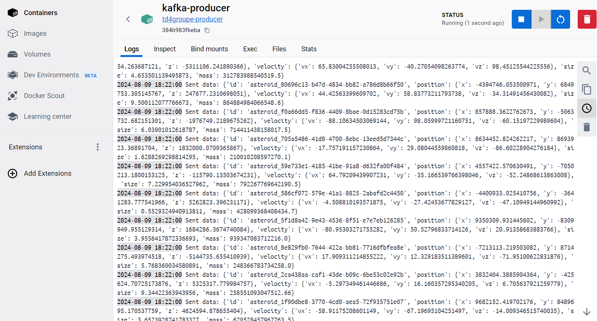
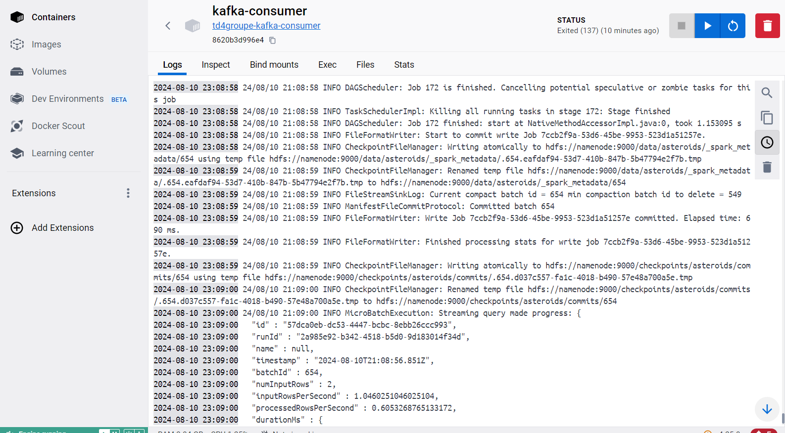
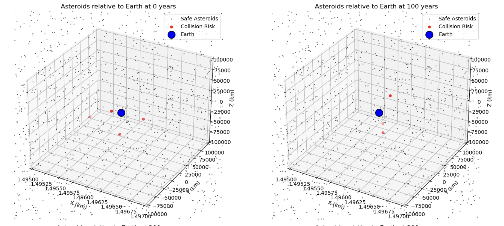
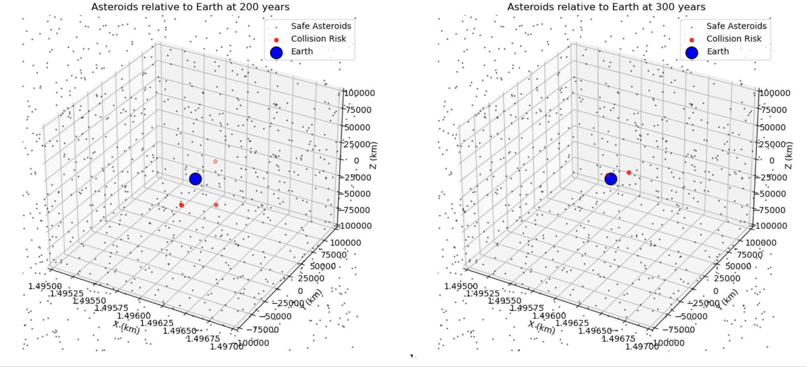
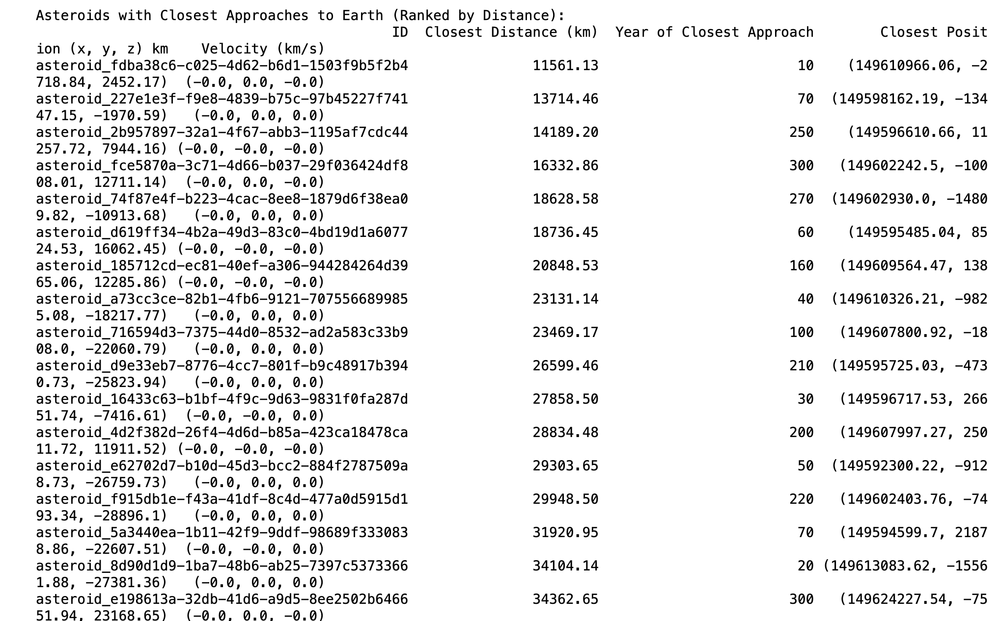
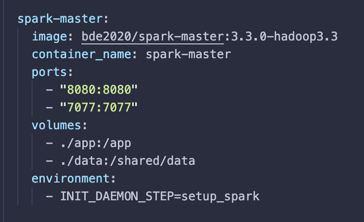
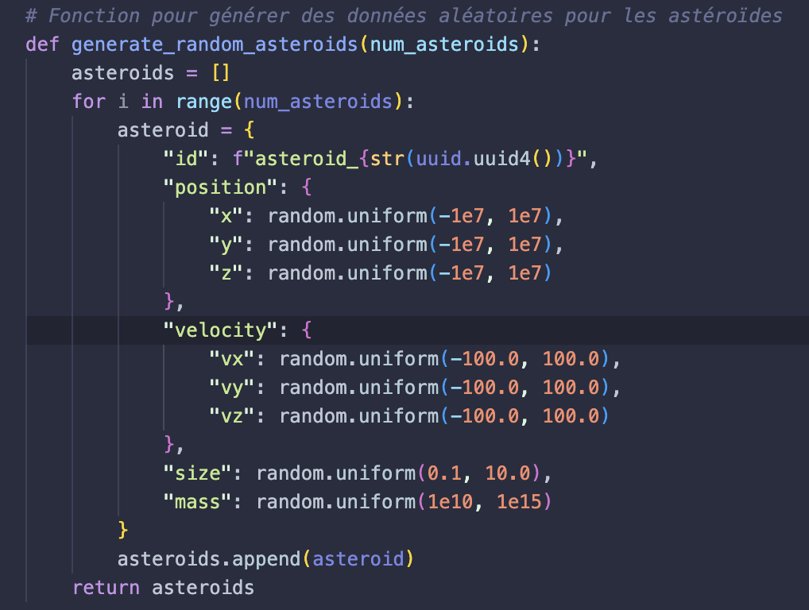

# Projet Asteroid Prediction

## Introduction

### Contexte

Ce projet a pour objectif de prédire la probabilité de collision des astéroïdes avec la Terre en utilisant des données simulées et des algorithmes de Machine Learning. Les données des astéroïdes sont générées et publiées sur Kafka, stockées dans HDFS, puis traitées et analysées à l’aide de Spark et visualiser avec Matplotlib.

### Objectifs

- Générer des données simulées pour les astéroïdes.
- Stocker et traiter les données avec Hadoop et Spark.
- Développer et évaluer des modèles de prédiction de collision.
- Visualiser les résultats et rédiger un rapport détaillé.

### Technologies Utilisées

- **Kafka** : Pour la gestion des flux de données.
- **Hadoop (HDFS)** : Pour le stockage des données.
- **Spark** : Pour le traitement des données.
- **Python** : Pour la génération des données et le développement des modèles.
- **Scikit-learn** : Pour la modélisation prédictive.
- **Matplotlib, Seaborn, Plotly** : Pour la visualisation des résultats.
- **Docker**: Conteneurisation des technos.

---
## Git
Pour récupérer le code sur git : ```bash git clone https://github.com/arnaudlagarde/TD4Groupe.git```

## Architecture Docker

Nous avons utilisé Docker pour simplifier la configuration et la gestion de notre environnement de développement et de production. Docker permet de déployer facilement les applications sur n'importe quel système tout en assurant la cohérence entre les environnements.

### Docker Compose

Pour orchestrer nos services, notamment Kafka, Hadoop, et Spark, nous avons utilisé Docker Compose. Cela nous a permis de définir et de gérer l'ensemble de notre infrastructure de services de manière déclarative et dans un fichier unique.

- **Fichier `docker-compose.yml`** : [Voir le fichier ici](docker-compose.yml)

### Avantages de l'utilisation de Docker

- **Uniformité** : Docker assure que notre application s'exécute de la même manière, indépendamment de l'environnement local, de développement ou de production.
- **Isolation** : Chaque service s'exécute dans son propre conteneur, ce qui minimise les conflits entre les dépendances.
- **Reproductibilité** : Facilite la mise en place rapide de nouveaux environnements de développement et de test.

Cette architecture nous a aidés à surmonter les défis liés à la configuration des différents outils et à la gestion des dépendances, réduisant ainsi les erreurs de configuration et les incompatibilités entre les environnements.

### Exécution avec Docker Compose

Pour démarrer l'ensemble des services définis dans le fichier `docker-compose.yml`, utilisez la commande suivante :

```bash
docker-compose up -d
```

---
## Génération de Données

### Script de Génération des Données

Lancer le script : 
```bash
python generate_data.py
```


## Scripts Spark

### Script de Nettoyage des données 
```bash
docker exec -it spark-master /bin/bash
```
L'executer depuis le spark master : 
```bash
/spark/bin/spark-submit /app/data_cleaning.py
```

## Stockage et Traitement des Données

### Stockage dans Hadoop (HDFS)

  - **Producteur Kafka** : Les données des astéroïdes sont générées par un producteur Kafka, qui simule ou collecte des informations sur les astéroïdes, telles que leur position, vitesse, taille et masse. Ces données sont ensuite sérialisées en JSON et envoyées à un topic Kafka nommé `asteroids-topic`.

  - **Consommateur Kafka avec Spark** : Un consommateur Kafka, implémenté avec Apache Spark, est configuré pour lire en continu les messages du topic `asteroids-topic`. Spark lit les données en streaming depuis Kafka, les désérialise et les traite en temps réel.

  - **Traitement des Données** : Après ingestion, les données sont converties dans une structure tabulaire à l'aide de Spark. Cette étape permet de valider, nettoyer, et structurer les données pour qu'elles soient prêtes à être stockées.

  - **Stockage dans HDFS** : Les données traitées sont ensuite stockées dans Hadoop Distributed File System (HDFS). Chaque enregistrement d'astéroïde est sauvegardé en format JSON dans un répertoire spécifique sur HDFS. Le chemin de stockage est généralement configuré pour utiliser un nom de répertoire comme `/data/asteroids`, ce qui permet de centraliser toutes les données des astéroïdes.

  - **Tolérance aux Erreurs et Reprise** : Grâce à l'utilisation de Kafka et Spark, le système est conçu pour être tolérant aux erreurs. Si une panne survient, Kafka assure que les messages ne sont pas perdus, tandis que Spark utilise un système de checkpoint pour redémarrer la lecture à partir de l'endroit où elle s'était arrêtée.

  - **Checkpointing et Consistance des Données** : Pour garantir la consistance des données et la tolérance aux pannes, Spark utilise des checkpoints, enregistrant régulièrement son état dans HDFS. Cela permet de reprendre le traitement là où il s'était arrêté en cas de défaillance du système.

  Ce flux de traitement assure que les données des astéroïdes sont ingérées en temps réel, traitées efficacement, et stockées de manière fiable dans HDFS, prêtes à être utilisées pour des analyses ultérieures ou des modèles prédictifs. 

  Cela est fait automatiquement au lancement du docker a travers deux Dockerfile pour les conteneurs responsable du producer et du consumer de Kafka

  **Execution Kafka producer/consumer**
    
    
    
  ### Traitement avec Spark

  - **Lecture des Données** 
      Les datas sont récupérés après l'ingestion depuis le dossier `/data/asteroids` sur HDFS
  - **Nettoyage des Données**
      [Script de nettoyage et de mise en forme](app/data_cleaning.py): 
      - Chargement : Les données des astéroïdes sont chargées depuis HDFS.
      - Nettoyage : Suppression des valeurs nulles et des enregistrements avec des valeurs aberrantes (masse, taille, position, vitesse).
      - Calcul de Distance : Ajout d'une colonne distance_to_earth pour calculer la distance entre chaque astéroïde et la Terre.
      - Variable de Collision : Création d'une colonne collision pour indiquer les risques de collision, basée sur la distance.
      - Sauvegarde : Les données nettoyées et préparées sont sauvegardées dans HDFS pour l'analyse prédictive.
  - **Analyse des Trajectoires**
      Les scripts d'analyse des trajectoires modélisent les mouvements des astéroïdes en utilisant leurs positions et vitesses. Ils calculent les trajectoires pour prédire les déplacements futurs, détectent les astéroïdes qui s'approchent de la Terre, et visualisent ces trajectoires pour une interprétation facile des risques de collision.


## Modélisation Prédictive

### Sélection des Algorithmes

- **Algorithmes Choisis** : Nous avons opté pour la régression logistique en raison de sa simplicité et de son efficacité pour les tâches de classification binaire, telles que la prédiction des collisions d'astéroïdes. Cet algorithme est bien adapté à notre problème de prédiction de collisions.

### Entraînement du Modèle

- **Entraînement** : Les données ont été préparées et nettoyées avant d'être utilisées pour l'entraînement du modèle. Un pipeline Spark a été créé pour assembler les caractéristiques des astéroïdes en vecteurs de caractéristiques, suivi d'un modèle de régression logistique. Les données ont été divisées en ensembles d'entraînement (80%) et de test (20%) pour entraîner le modèle. Le modèle a été entraîné en utilisant PySpark pour tirer parti du traitement distribué. ([Script :](app/model_training.py))

- **Validation** : La performance du modèle a été évaluée en utilisant l'AUC-ROC comme métrique principale. Un `CrossValidator` avec une grille de paramètres a été utilisé pour optimiser les hyperparamètres. Les prédictions finales ont été sauvegardées dans HDFS pour une analyse plus approfondie. ([Script :](app/batch_prediction.py))

### Fichiers en charge de chaque étape

1. **`model_training.py`** : Ce script est responsable de l'entraînement du modèle. Il prend les données nettoyées, les transforme en vecteurs de caractéristiques, entraîne un modèle de régression logistique, et optimise les hyperparamètres à l'aide d'une validation croisée. Le modèle entraîné est ensuite sauvegardé dans HDFS.

2. **`batch_prediction.py`** : Ce script utilise le modèle entraîné pour effectuer des prédictions en batch sur de nouvelles données d'astéroïdes. Les résultats de la prédiction, y compris la probabilité de collision, sont sauvegardés dans HDFS pour une analyse ultérieure.

Ces scripts forment un pipeline de modélisation prédictive complet, allant de l'entraînement du modèle à l'application des prédictions sur des données nouvelles. Ils utilisent Apache Spark pour un traitement rapide et efficace des grandes quantités de données d'astéroïdes.


## Visualisation

### Visualisations des Trajectoires

- **Graphiques** : 





## Discussion

### Interprétation des Résultats

Les simulations ont mis en évidence des trajectoires d'astéroïdes qui se rapprochent de la Terre, soulignant l'efficacité de notre modèle pour identifier les risques potentiels. Les résultats montrent que certains astéroïdes passent près de la Terre, justifiant une surveillance continue pour anticiper des mesures de déviation. Les visualisations en trois dimensions offrent une perspective claire sur ces approches, essentielle pour les planificateurs et les chercheurs.

### Analyse des Astéroïdes les Plus Proches

Plusieurs astéroïdes s'approchent à des distances critiques, comme l'astéroïde `asteroid_fdba38c6-c025-4d62-b6d1-1503f9b5f2b4` avec une proximité de 11,561 km dans une dizaine d'année (ce sont de fausses données et nous avons fait en sorte que cela se produise). 


### Défis Rencontrés

- **Problèmes** : 
    ``Collisions Astéroïdes-Terre``: Un des défis majeurs a été de ne pas détecter suffisamment de risques de collision avec la Terre. Les valeurs initiales des positions et vitesses des astéroïdes étaient trop élevées, ce qui compliquait l’identification des trajectoires à risque. Pour pallier cela, nous avons ajusté les simulations pour générer des astéroïdes se dirigeant directement vers la Terre. Bien que cette approche soit moins réaliste, elle a permis d’améliorer les visualisations et les modèles prédictifs en créant des cas de test concrets pour mieux évaluer les risques potentiels.

    ``Problèmes de Docker``: L’utilisation de Docker a posé des problèmes de compatibilité et de configuration, nécessitant des ajustements fréquents des fichiers Dockerfile et des paramètres de conteneur pour garantir un environnement stable.

    ``Versions de Python pour Spark``: Des problèmes de compatibilité ont été rencontrés avec Spark, notamment en raison de l’utilisation de différentes versions de Python. Il a fallu synchroniser les versions de Python sur tous les environnements pour assurer le bon fonctionnement des bibliothèques Spark.

    ``Configuration du PATH Java``: La configuration incorrecte du PATH Java a occasionné plusieurs erreurs lors de l’exécution de Spark, nécessitant un ajustement manuel des variables d’environnement pour pointer vers la version correcte de Java.

    ``Travail collaboratif`` : Difficile de se répartir les tâches en sachant que le travail de l'un est nécessaire pour l'autre qui ne peut rien faire pendant ce temps là.

### Améliorations

- **Amélioration de la Génération de Données** : Enrichir la simulation de données d'astéroïdes avec des modèles physiques plus avancés pour mieux refléter la diversité et les comportements des astéroïdes réels. Effet de la gravité de la Terre sur les trajectoires etc...

- **Intégration de Données Réelles** : Incorporer des données astronomiques réelles provenant de sources fiables telles que la NASA pour valider et améliorer la précision des modèles de prédiction. Cela aiderait à aligner les simulations avec des scénarios du monde réel. - La génération d'astéroïdes a été faite un peu vite ce qui nous a causé de nombreux problèmes lors de la Visualisation et la réalisation des modèles de ML.

- **Optimisation des Modèles** : Explorer d'autres algorithmes de machine learning ou de deep learning, tels que les random forest ou les RNN, pour améliorer les performances des prédictions. 

- **Scalabilité et Performance** : Améliorer la scalabilité du pipeline de données en optimisant l'utilisation de Spark et en explorant des solutions de calcul distribué supplémentaires comme Apache Flink.

- **Automatisation des Pipelines** : Mettre en place des pipelines de traitement et d'analyse de données automatisés utilisant des technologies comme Airflow ou Kubeflow. en production.

- **Visualisations Améliorées** : Développer des visualisations interactives plus avancées, permettant aux utilisateurs d'explorer dynamiquement les trajectoires et les prédictions de collision des astéroïdes. L'utilisation de technologies comme WebGL pourrait enrichir l'expérience utilisateur.

---

## Conclusion

### Perspectives Futures

- **Travail Futur** : 
	•	Amélioration des Modèles : Explorer des modèles avancés, comme les réseaux de neurones profonds, pour améliorer les prédictions de collision.
	•	Intégration de Données Réelles : Utiliser des données astronomiques réelles pour affiner les simulations et accroître le réalisme des résultats.
	•	Optimisation des Performances : Optimiser le traitement des données avec Spark et envisager d’autres solutions comme Apache Flink pour améliorer l’efficacité.
	•	Visualisations Interactives : Améliorer les visualisations interactives pour permettre une exploration plus intuitive des trajectoires et des risques.

---

## Annexes

### Code Source




### Données

- **Exemples** : Voici des exemples de données utilisées pour les tests et l’entraînement, représentant des astéroïdes avec leurs positions, vitesses, tailles, et masses :

```json
[
  {
    "id": "asteroid_000",
    "position": {
      "x": 222699.68154550303,
      "y": -170502.49676500133,
      "z": 96286.63452916636
    },
    "velocity": {
      "vx": -44.97868922069429,
      "vy": -43.36883583999207,
      "vz": -25.59081952536193
    },
    "size": 7.4,
    "mass": 326766029087404.1
  },
  {
    "id": "asteroid_001",
    "position": {
      "x": 241510.24486868948,
      "y": -168452.54814790297,
      "z": -69360.43184168254
    },
    "velocity": {
      "vx": 26.831251068521794,
      "vy": -1.8149620055246487,
      "vz": -46.032363223946696
    },
    "size": 9.44,
    "mass": 870778504940109.8
  },
  {
    "id": "asteroid_002",
    "position": {
      "x": 388430.33475928206,
      "y": 103642.09747688752,
      "z": 77811.35800764093
    },
    "velocity": {
      "vx": 25.627763490355875,
      "vy": -10.60880719214665,
      "vz": -17.034735038669922
    },
    "size": 6.05,
    "mass": 594347471261444.2
  },
  {
    "id": "asteroid_003",
    "position": {
      "x": 408252.9731877086,
      "y": 171151.49242054566,
      "z": 34378.74584184485
    },
    "velocity": {
      "vx": 18.25062679578167,
      "vy": -18.976092532415546,
      "vz": -30.3861330406611
    },
    "size": 2.74,
    "mass": 350618904146509.5
  }
]

## Équipe

Ce projet a été réalisé par :

- Arnaud LAGARDE ([GitHub](https://github.com/arnaudlagarde))
- Pierre-Antoine SAMUEL ([GitHub](https://github.com/PAS2024))
- Nadim HAMIMID ([GitHub](https://github.com/NadimHipssi))